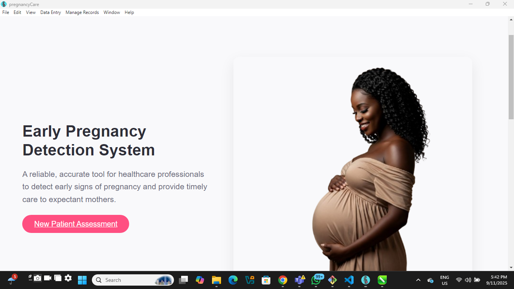

# PregnancyCare-desktop
# 

PregnancyCare-desktop is an Electron-based desktop application designed to streamline the management of patient records, diagnoses, reports, and ultrasounds in a pregnancy care setting. The project demonstrates modular architecture, robust backend integration, and a modern UI, making it a strong showcase for backend engineering and full-stack development skills.

---

## What Problem Does This Project Solve?

Healthcare providers often struggle with fragmented patient data and inefficient workflows. PregnancyCare-desktop solves this by providing a unified platform for managing patient information, medical records, and diagnostic data. It enables quick CRUD operations, secure data handling, and seamless navigation, improving both clinical efficiency and patient outcomes.

**Additionally, PregnancyCare-desktop helps estimate conception and delivery dates, supporting clinicians in providing timely and accurate care for expectant mothers.**

---

## Tech Stack Used

- **Electron**: For cross-platform desktop application development.
- **Node.js**: Backend logic and server integration.
- **Express** (server, not shown here): RESTful API for patient and medical data.
- **Bootstrap**: Responsive UI components.
- **Custom CSS/JS**: For tailored user experience.
- **IPC (Inter-Process Communication)**: Secure communication between renderer and main processes.
- **Tailwind CSS**: Utility-first CSS framework (config included).
- **HTML5/CSS3/JavaScript**: Core frontend technologies.

---

## Architecture Decisions

- **Single BrowserWindow Navigation**: Chosen for performance, simplicity, and maintainability. All views are loaded dynamically, reducing resource usage and complexity.
- **Modular Structure**: Code is organized into `component`, `main`, `windows`, and `renderer` folders for separation of concerns and scalability.
- **IPC-Based Navigation**: Ensures secure and efficient communication between UI and backend logic.
- **Strict Content Security Policy (CSP)**: Enforced in all HTML files to mitigate XSS and other vulnerabilities.
- **Reusable Components**: Navigation and form elements are modular for easy extension and maintenance.

---

## What I Learned

- **Electron Security Best Practices**: Implemented context isolation, preload scripts, and strict CSP to secure the app.
- **Backend Integration**: Learned how to connect Electron frontends to RESTful APIs, handle CORS, and manage asynchronous data flows.
- **State Management**: Explored strategies for managing navigation and data persistence in desktop apps.
- **Cross-Platform Issues**: Gained experience in handling file paths, permissions, and cache issues on Windows.

---

## Challenges Faced & How I Overcame Them

- **CORS and CSP Issues**: Initial requests to the backend were blocked due to restrictive policies. Solved by configuring server CORS headers and updating CSP in HTML files.
- **Window Management**: Migrated from multiple windows to a single-window architecture, simplifying navigation and improving performance.
- **File Path Errors**: Encountered issues with resource loading due to relative paths. Fixed by standardizing path resolution and project structure.
- **Cache and Permission Errors**: Electron cache errors on Windows were mitigated by adjusting app permissions and ignoring non-critical warnings.
- **IPC Communication**: Ensured robust communication between renderer and main processes by implementing clear IPC channels and error handling.

---

## Features

- Patient management: create, update, delete, and view patient records
- Diagnosis management: create, update, delete, and view diagnoses
- Ultrasound management: create, update, delete, and view ultrasound records
- Report generation and viewing
- Navigation via a single BrowserWindow for smooth user experience
- Responsive UI using Bootstrap and custom styles
- IPC-based navigation for returning to home or previous pages
- **Estimation of conception and delivery dates for expectant mothers**

---

## Project Structure

```
PregnancyCare-desktop/
├── component/           # Reusable HTML components (e.g., nav-buttons)
├── main/                # Main Electron process scripts
│   ├── app.js           # Main window creation and management
│   ├── init.js          # App initialization and IPC handlers
│   ├── menu.js          # Application menu setup
│   ├── preload.js       # Preload script for context isolation
│   ├── renderer.js      # (Optional) Renderer process logic
│   ├── util.js          # Utility functions (e.g., loadView)
│   └── windows/         # Window management modules
│       ├── diagnosticWindows.js
│       ├── patientWindows.js
│       ├── reportWindows.js
│       └── ultrasoundWindows.js
├── renderer/            # Renderer process (UI) files
│   ├── error.html
│   ├── index.html       # Home page
│   ├── ...              # Other HTML views
│   ├── create/          # Create forms and logic
│   ├── custom_css/      # Custom styles
│   ├── custom_js/       # Custom JS scripts
│   ├── delete/          # Delete forms and logic
│   ├── fonts/           # Font files
│   ├── images/          # App images
│   ├── reports/         # Report templates and logic
│   ├── src/             # Source images, JS, SCSS
│   ├── update/          # Update forms and logic
│   ├── view/            # View pages
│   ├── view_forms/      # View form pages
├── package.json         # Project metadata and dependencies
├── tailwind.config.js   # Tailwind CSS configuration
└── Readme.md            # Project documentation
```

---

## Getting Started

### Prerequisites
- Node.js (v14 or higher recommended)
- npm (comes with Node.js)

### Installation
1. Clone the repository:
   ```sh
   git clone https://github.com/AnaeleJoshua/PregnancyCare-desktop.git
   cd PregnancyCare-desktop
   ```
2. Install dependencies:
   ```sh
   npm install
   ```

### Running the App
Start the Electron app:
```sh
npm start
```
Or, for development with live reload:
```sh
npm run dev
```

---

## Usage

- Use the menu to navigate between patient, diagnosis, ultrasound, and report sections.
- Create, update, delete, and view records using the provided forms.
- Return to the home page or previous page using navigation buttons (IPC-based).
- Estimate conception and delivery dates for patients.

---

## Development Notes

- All navigation is handled via a single BrowserWindow for performance and simplicity.
- IPC is used for communication between renderer and main processes (e.g., navigation).
- Content Security Policy (CSP) is set in each HTML file for security.
- Bootstrap and custom CSS are used for styling.

---

## Folder Details

### component/
Reusable HTML components, such as navigation buttons.

### main/
Main Electron process scripts, including window management, menu setup, and IPC handlers.

### main/windows/
Modules for creating and managing different app windows (now refactored to use single window navigation).

### renderer/
All UI files, including HTML views, forms, custom styles, images, and JS scripts.

---

## Security

- CSP is enforced in all HTML files.
- Avoids use of `unsafe-eval` and remote scripts.
- IPC is used for safe navigation and communication.

---

## Contributing

Pull requests are welcome! For major changes, please open an issue first to discuss what you would like to change.

---

## License

MIT